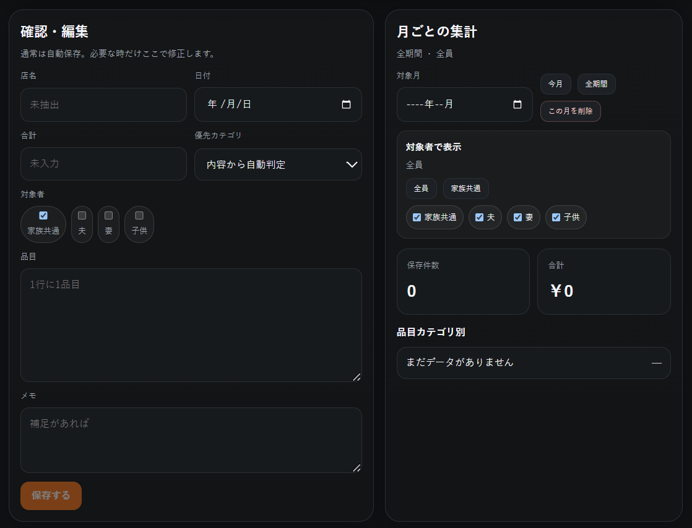
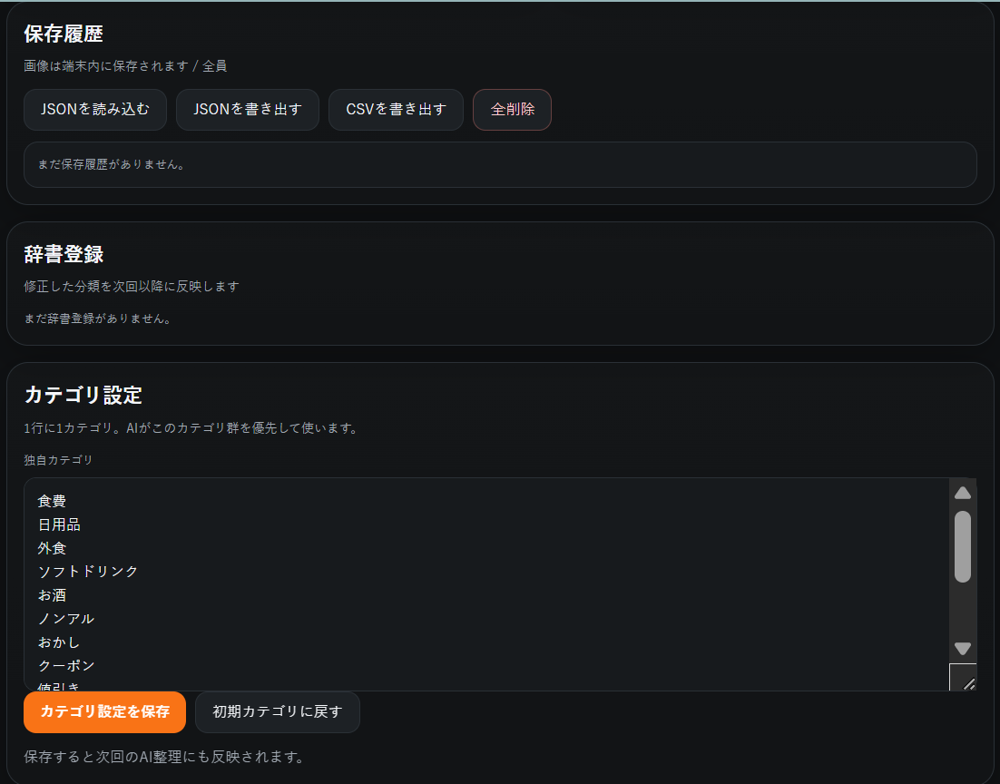
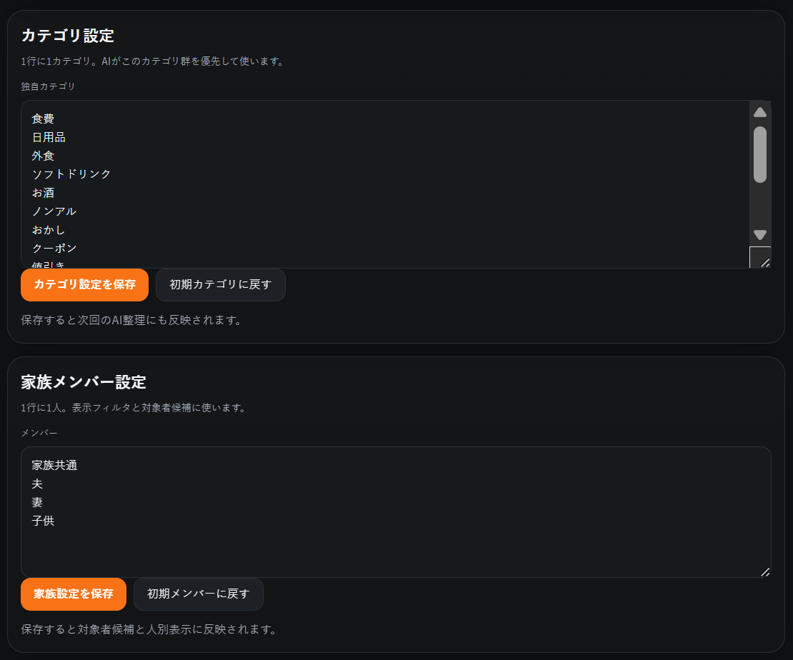

# KAKEI-BO3

**KAKEI-BO3** は、レシートを撮影するだけで、店名・日付・合計金額・買ったものを整理して保存できる家計簿アプリです。  
スマホでもパソコンでも使える **PWA** 形式なので、Webページとして開くだけで使えます。スマホのホーム画面に追加すれば、普通のアプリのように起動できます。

家族で使うことを想定しており、**夫・妻・子供・家族共通** など、誰の支出かを分けて記録できます。  
また、妻や夫など別の端末で書き出したJSONを、メイン端末に **追加インポート** できます。既存データを消さずに、後から合流できる設計です。

---

## 画面イメージ

### 1. メイン画面

レシート画像を選ぶ、またはスマホで撮影して記録を始めます。


### 2. 確認・編集と月ごとの集計

AIで読み取った内容は基本的に自動保存されます。必要なときだけ内容を直せます。  
右側では、月ごとの合計やカテゴリ別の支出を確認できます。



### 3. 保存履歴・辞書登録・カテゴリ設定

保存済みの記録を確認したり、JSON/CSVで書き出したりできます。  
よく出る品目はカテゴリ辞書に登録できるので、次回から分類しやすくなります。



### 4. 家族メンバー設定

家族メンバーを自由に編集できます。  
新規入力時に最初から選ばれる対象者も、家族共通・夫・妻・子供・任意メンバーから選べます。



---

## このアプリでできること

KAKEI-BO3 では、主に以下のことができます。

- レシートを撮影して、内容をAIで整理する
- 店名、日付、合計金額、品目を自動で入力する
- 食費、日用品、外食などのカテゴリに分ける
- 記録を月ごとに集計する
- 夫、妻、子供、家族共通など、対象者ごとに記録する
- 新規入力時のデフォルト対象者を設定する
- レシートなしの支出を手入力する
- 毎月の固定費を登録する
- JSONでバックアップする
- 他の家族が書き出したJSONを追加する
- CSVで書き出して表計算ソフトなどで使う

---

## 最初に必要なもの

KAKEI-BO3 のAI整理機能を使うには、**OpenAI APIキー** が必要です。

初回起動時に、画面にAPIキー入力欄が出ます。  
そこに自分のOpenAI APIキーを入力して、「APIキーを保存して開始」を押してください。

入力したAPIキーは、使っている端末のブラウザ内に保存されます。  
アプリのサーバー側には保存しません。

共有端末で使った場合や、APIキーを消したい場合は、アプリ内の設定から削除できます。

---

## 基本的な使い方

### 1. レシートを記録する

1. アプリを開きます。
2. 「ここを押して撮影」を押します。
3. カメラでレシートを撮るか、保存済み画像を選びます。
4. 「AIで整理する」を押します。
5. 読み取りが成功すると、自動で保存されます。
6. 保存後に間違いがあれば、「編集」から直します。

KAKEI-BO3 では、毎回確認してOKを押す必要はありません。  
読み取り内容が問題なさそうな場合は、そのまま保存されます。

読み取りが不完全な場合だけ、確認・編集画面で止まります。

---

### 2. 長いレシートを記録する

長いレシートが1枚の写真に入りきらない場合は、2枚に分けて読み取れます。

1. まず1枚目の画像を選びます。
2. 「長いレシートの続き画像を追加」を押します。
3. 2枚目の画像を選びます。
4. 「AIで整理する」を押します。

2枚の画像をまとめて解析します。

---

### 3. レシートなしで記録する

レシートがない支出も記録できます。

1. 「レシートなしで記録」を押します。
2. 店名、日付、合計、品目、メモなどを入力します。
3. 対象者を選びます。
4. 保存します。

レシートなし入力では、AI抽出や前回のレシート結果は使いません。  
そのため、関係ない店名や金額が勝手に入ることを防ぎます。

---

## 対象者について

KAKEI-BO3 では、支出を誰のものとして記録するかを選べます。

初期状態では、以下のような対象者があります。

- 家族共通
- 夫
- 妻
- 子供

家族構成に合わせて、名前を変更したり、任意のメンバーを追加したりできます。

また、新しい記録を作るときに最初から選ばれる対象者を設定できます。  
たとえば、妻が主に入力する端末なら「妻」をデフォルトにできます。夫が主に入力する端末なら「夫」をデフォルトにできます。

既に保存した記録の対象者は、デフォルト設定を変えても勝手には変更されません。

---

## 固定費の使い方

家賃、保険、サブスク、習い事など、毎月だいたい同じ支出は **固定費** として登録できます。

固定費に登録しておくと、毎月の支出として自動で計上できます。  
同じ月に何度も重複して登録されないように、月ごとの固定費IDで管理しています。

固定費として登録しやすいものの例です。

- 家賃
- 保険
- スマホ料金
- サブスク
- 習い事
- 駐車場代
- ローン

金額が変わるものは、あとから編集できます。

---

## JSONバックアップと追加インポート

KAKEI-BO3 では、記録や設定をJSONとして書き出せます。

JSONには、以下の内容が含まれます。

- 保存履歴
- 固定費設定
- カテゴリ設定
- 家族メンバー設定
- 新規入力時のデフォルト対象者
- 品目カテゴリ辞書

### 他の家族のデータを追加する場合

妻や夫など、別の端末で書き出したJSONをメイン端末に読み込むことができます。

このとき、既存データは消えません。  
JSON内の記録だけを追加し、同じ記録がある場合は重複をスキップします。

つまり、メイン端末に妻のJSONを読み込んでも、メイン端末のデータは残ります。  
妻の記録だけが追加されます。

---

## CSV書き出し

保存した記録はCSVとして書き出せます。  
CSVは、Excel、Googleスプレッドシート、Numbersなどで開けます。

家計の確認、集計、印刷、別の家計簿への移行などに使えます。

---

## スマホにインストールする方法

### Android / Chrome

1. アプリのページをChromeで開きます。
2. 画面上に「インストール」ボタンが出たら押します。
3. 出ない場合は、Chromeのメニューから「ホーム画面に追加」を選びます。

### iPhone / Safari

1. アプリのページをSafariで開きます。
2. 共有ボタンを押します。
3. 「ホーム画面に追加」を選びます。

ホーム画面に追加すると、普通のアプリのように起動できます。

---

## デプロイ方法

Cloudflare Pages にデプロイする場合は、ZIPをデスクトップに展開してから、PowerShellで以下を実行します。

```powershell
cd "$env:USERPROFILE\Desktop\KAKEI-BO3-main"
npx wrangler pages deploy . --project-name kakei-bo3
```

別のプロジェクト名で公開したい場合は、`kakei-bo3` の部分を変更してください。

---

## ファイル構成

主なファイルは以下です。

```text
KAKEI-BO3-main/
├─ index.html                アプリ本体のHTML
├─ app.js                    アプリの処理
├─ styles.css                画面デザイン
├─ manifest.webmanifest      PWA設定
├─ functions/api/analyze.js  AI解析用のCloudflare Pages Function
├─ screenshot1.png           メイン画面
├─ screenshot2.png           確認・編集と月ごとの集計
├─ screenshot3.png           保存履歴・設定
├─ screenshot4.png           家族メンバー設定
├─ DEPLOY-KAKEI-BO3.md       デプロイ手順
├─ deploy-kakei-bo3.ps1      PowerShell用デプロイスクリプト
└─ deploy-kakei-bo3.bat      Windows用デプロイスクリプト
```

---

## 注意点

- AIの読み取り結果は必ずしも完全ではありません。
- 金額や日付が大事な場合は、保存後に確認してください。
- APIキーは各端末のブラウザ内に保存されます。
- 共有端末で使う場合は、使用後にAPIキーを削除してください。
- JSONバックアップは定期的に保存しておくと安心です。

---

## アプリ名

**KAKEI-BO3**  
Receipt-based family expense recorder with AI-assisted extraction, manual entry, fixed costs, member-based ownership, JSON backup, and additive import.
